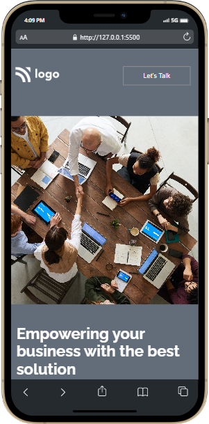

# Business Landing Page with React

***
## Description

This project [Business Landing Page with React](https://business-react.netlify.app/) was built using React.js. The main aim was to learn the basics of React and convert previously built HTML & CSS site to **React Components**.

***

### Links for Project

* [LIVE Project Link](https://business-react.netlify.app/)

* [Youtube Video Demo](https://youtu.be/Nto_1rFGHGc)

* [Source Code](#business-landing-page-with-react)

***
### Built With 

* React.js
* HTML
* CSS

***

### Screencaptures of Project

 

  1. #### Whole Webpage(Large screens)

   

  

   

  2. #### Mobile View

 

 

***

### Checkout Portfolio & Other Projects
 

#### [Personal Portfolio](https://shubhambhoj.in/)

#### [Findcoder Profile](https://www.findcoder.io/u/shubham_singh)
***

### Connect with Me
* [Mailto](mailto:shubhambhoj3@gmail.com)
* [LinkedIn](https://www.linkedin.com/in/shubham-singh-b122b7171/)
* [Github](https://github.com/ShubhamSingh03)
* [Findcoder](https://www.findcoder.io/u/shubham_singh)
***
***
[go to top](#business-landing-page-with-react)